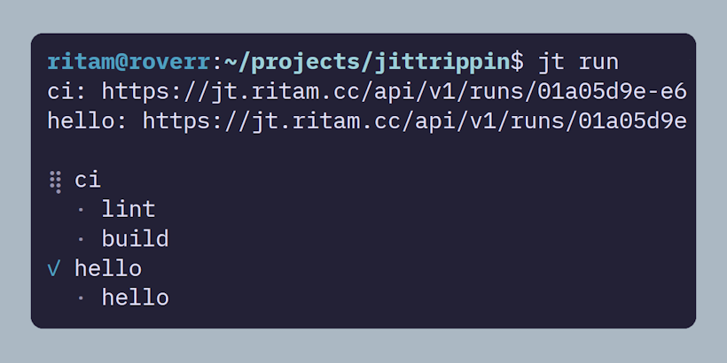

# JitTrippin (JT)


> CI/CD Engine for the average monkeybrain. minus YAML.

**JitTrippin is:**

- a CI engine, served to you as a go package (`jittrippin/pkg`)
- a selfhostable CI engine server (`jtd`)
- a CLI to talk to said server (`jt`)

JitTrippin exists because YAML (for CI/CD) deserves to be thrown into a vat of lava.

**With JitTrippin,**

- You define your pipelines in **programmable Lua.**
- You can choose the environment you run your pipelines. (ie. Docker, Podman, MicroVM etc.)\*
- You can choose whatever Storage method you want to use for your artifacts. (ie. Disk, S3 etc.)\*

\* [implemented per server instance]

Of course, choices only exist if they are implemented.
JitTrippin is in very early development. We have Docker + Disk Storage (for artifacts) for now.



## References

1. CLI Reference: [spec/cli.md](./spec/cli.md)
2. Pipelines in Lua Reference: [spec/lua.md](./spec/lua.md)
3. Selfhosting `jtd`: [spec/selfhost.md](./spec/selfhost.md)

## Pipelines

Pipelines are written in Lua, so you get normal programming language features like
variables, loops, and functions instead of dreaded YAML syntax.

Example: `hello-world.lua`

```lua
pipeline "hello-world" {}

checkout {
    url = "https://github.com/nxrmqlly/jittrippin",
    branch = "master",
}

github {
    push = {
        branch = "master",
    },
}

job "echo-stuff" {
    image = "alpine:latest",

    run "echo hello world!",
    run "named step" {
        cmd = "echo some stuff here..."
    }
}
```

### Learn how to define a pipeline [here.](./spec/lua.md)

## Installing

### Prerequisites

- [Docker](https://www.docker.com/)
- [Go](https://go.dev/dl) (if using `go install` or building from source)

### Using `go install`

**The `jt` CLI:**

```sh
go install github.com/nxrmqlly/jittrippin/cmd/jt@latest
```

**The `jtd` REST API Daemon:**

```sh
go install github.com/nxrmqlly/jittrippin/cmd/jtd@latest
```

### Building from source

Clone this repo, cd into it, then:

```sh
go build -o ./jt ./cmd/jt   # compile the CLI
go build -o ./jtd ./cmd/jtd # compile the daemon
```

### Releases

(Some) Prebuilt binaries are available on the [Releases Page](https://github.com/nxrmqlly/jittrippin/releases/)

## Quick Start

1. Connect to a JitTrippin daemon (**optional**, if running locally only)

```sh
jt auth login       # log into a remote daemon
jt integrations add # connect your GitHub account and install JitTrippin
jt repos add        #  choose the repositories JT should track
```

2. Set up a project

Inside your project directory:

```sh
jt init
```

This creates a pipelines directory and a `.jtrc` in the root dir

Create `.jt/hello.lua`:

```lua
pipeline "hello-world" {}

job "echo-stuff" {
    image = "alpine:latest",

    run "echo hello world!",
    run "named step" {
        cmd = "echo some stuff here..."
    }
}
```

3. Run

```sh
jt run # or, jt run --local to run locally
```

## Selfhosting

A comprehensive selfhosting guide is available at [spec/selfhost.md](./spec/selfhost.md)

## Contributing

JitTrippin is open to contributions!
If you would like to fix a bug or add a new feature, create a PR!

## Compatibility and Current State

JitTrippin is very early stage software

Its is designed for Linux and MacOS primarily, Windows support is untested. (for daemon)

It also assumes that pipelines will run in Linux containers. Support for Windows containers is only best-effort.
